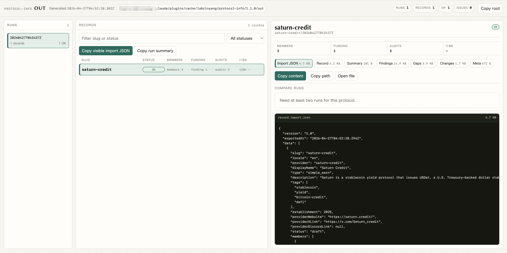

# protocol-info

[English](README.md) | 简体中文

`protocol-info` 是一个 Claude Code 插件，也可以作为独立 CLI 使用。它用于调研 DeFi earn/yield/staking 协议，并生成通过 JSON Schema 校验的 `EarnProtocolInfo` JSON。

它会以 headless 模式调用 Claude，从 RootData、DeFiLlama 等可选 fetcher 获取结构化证据，按字段合并和对账，校验最终记录，并可选择用 Haiku 翻译 19 个 locale 的字段。

输出应先人工审核，再通过 dashboard 的 `earn-protocol-info` import endpoint 导入。

## 适用场景

当你需要可重复的协议调研管线时，使用本项目：

- 协议简介、标签、官网、X、Discord 链接
- 成立年份
- 公开团队成员、职位、社媒链接、短 bio
- 融资轮次、投资方、金额、估值、日期
- 审计报告、审计方、范围、报告链接、扫描时间
- 字段级来源、未解决 gap、R2 改动审计
- 可选的 dashboard 多语言导入输出

它不是全自动发布系统。Crawler 负责产出可审核记录；团队、融资、审计信息仍应由人工复核后再进入生产。

## 作为 Claude Code 插件安装

推荐安装方式：

```text
/plugin marketplace add labrinyang/protocol-info
/plugin install protocol-info@labrinyang
```

可选 RootData 配置。每次运行时按以下顺序解析 key：

1. `--rootdata-key <key>` CLI 参数（一次性，不写入磁盘）
2. 调用 shell 中导出的 `ROOTDATA_API_KEY`
3. `~/.config/protocol-info/.env`（推荐：插件用户使用，更新插件时不会被覆盖）
4. `<repo>/.env`（仅独立 CLI；安装为插件时该路径在只读缓存里，会被忽略）

把 key 持久化到插件可读的位置：

```bash
mkdir -p ~/.config/protocol-info
echo "ROOTDATA_API_KEY=sk-..." > ~/.config/protocol-info/.env
chmod 600 ~/.config/protocol-info/.env
```

或者临时使用一次：

```bash
/protocol-info:protocol-info --rootdata-key sk-... --display-name "Pendle" --type fixed_rate
```

启动横幅的第一行会标明 key 的来源（`shell-env`、`--rootdata-key`，或解析到的 `.env` 路径）。不配置 `ROOTDATA_API_KEY` 时，管线仍然可用，只会跳过 RootData 证据。

安装后可以直接调用 slash command：

```text
/protocol-info:protocol-info --display-name "Pendle" --type fixed_rate
/protocol-info:protocol-info --display-name "Pendle" --type fixed_rate --i18n all
/protocol-info:protocol-info --parallel 4 --i18n zh_CN,ja_JP \
  --batch --display-name "Pendle" --type fixed_rate \
  --batch --display-name "Morpho" --type simple_earn
```

也可以用自然语言触发内置 skill，例如：

- “调研 Pendle 的 protocol info，并翻译成中文和日文。”
- “批量抓 Morpho 和 Aave 的 earn 信息，不要翻译。”
- “给我做一份 Lido 的 protocol-info。” 如果类型不明确，skill 会先问一个短问题。
- “Crawl protocol info for Morpho and translate to all locales.”
- “把已有 Pendle 记录补翻成日语。”
- “核实 Pendle 的 fundingRounds 并应用更新。”

Skill 位于 `skills/protocol-info-crawler/SKILL.md`，最终会派发到 `/protocol-info:protocol-info`。

## 作为独立 CLI 使用

克隆仓库后运行：

```bash
./run.sh --display-name "Pendle" --type fixed_rate
```

`run.sh` 只负责加载环境变量，然后委托给 `framework/cli.mjs`。它按以下顺序填充缺失的环境变量：

1. 调用 shell 中已经导出的环境变量
2. `~/.config/protocol-info/.env`
3. `<repo>/.env`

本地依赖：

| 工具 | 用途 |
| --- | --- |
| `claude` CLI | Headless Claude 调用 |
| `node` >= 18 | 管线运行时 |

## 常用命令

单协议：

```bash
./run.sh --display-name "f(x)Protocol" --type simple_earn
```

指定 slug、RootData ID 或调研提示：

```bash
./run.sh --display-name "Pendle" --type fixed_rate \
  --slug pendle \
  --rootdata-id 874 \
  --hints "Yield trading protocol with PT/YT markets"
```

批量运行：

```bash
./run.sh --parallel 4 \
  --batch --display-name "Pendle" --type fixed_rate \
  --batch --display-name "Morpho" --type simple_earn \
  --batch --display-name "Aave" --type simple_earn
```

i18n：

```bash
./run.sh --display-name "Pendle" --type fixed_rate --i18n all
./run.sh --display-name "Pendle" --type fixed_rate --i18n zh_CN,ja_JP,en_US
./run.sh --display-name "Pendle" --type fixed_rate --i18n none
```

基于已有 `out/<slug>/` 的工作流命令：

```bash
./run.sh get pendle description
./run.sh set pendle description '"更新后的源语言描述"'
./run.sh analyze pendle fundingRounds --query "verify latest funding rounds"
./run.sh analyze pendle fundingRounds --query "verify latest funding rounds" --apply
./run.sh i18n pendle --locales zh_CN,ja_JP
./run.sh refresh pendle funding
./run.sh history pendle
./run.sh diff pendle
./run.sh restore pendle <sha>
```

写入类命令都会先运行 deterministic normalizer，再校验完整记录；源字段变化时
会清理 stale i18n 产物，随后运行 post-processing 以保持
`record.import.json` 同步，在 `out/` 的本地 git 仓库里生成一个 scoped commit，
并刷新 `out/index.html`。不带 `--apply` 的 `analyze` 只输出提案，不写文件。

Dry run：

```bash
./run.sh --dry-run --display-name "Pendle" --type fixed_rate
```

## CLI 参数

| 参数 | 必填 | 说明 |
| --- | --- | --- |
| `--display-name <name>` | 是 | 协议显示名称。 |
| `--type <type>` | 否，推荐填写 | `fixed_rate`、`simple_earn`、`staking` 之一。不填时 metadata subtask 会尝试推断。 |
| `--slug <slug>` | 否 | 业务 key。默认由 display name 生成。 |
| `--hints <text>` | 否 | 传给 Claude 的额外调研上下文。 |
| `--rootdata-id <int>` | 否 | RootData 项目 ID。不填时，如果设置了 `ROOTDATA_API_KEY`，fetcher 会按名称搜索。 |
| `--batch` | 否 | 结束当前 provider，开始下一个 provider。 |
| `--model <name>` | 否 | 覆盖 R1 和 R2 使用的模型。manifest 默认值为 `claude-sonnet-4-6`。 |
| `--rootdata-key <key>` | 否 | 本次运行的 RootData API key，优先于 shell env 和 `.env` 文件，不会写入磁盘。 |
| `--max-turns <n>` | 否 | 每次 Claude 调用的 turn 上限，会向下 clamp manifest 默认值。 |
| `--max-budget <usd>` | 否 | 单个 provider 的总 LLM 预算上限，由 orchestrator 分配给 R1、R2、i18n。 |
| `--parallel <n>` | 否 | 并发 provider 数量，默认 `1`。 |
| `--i18n <flag>` | 否 | `none`、`all`，或逗号分隔 locale，例如 `zh_CN,ja_JP`。为空时静默跳过。 |
| `--i18n-parallel <n>` | 否 | locale 翻译并发数，默认 `8`。 |
| `--i18n-model <name>` | 否 | 覆盖 i18n 模型。manifest 默认值为 `claude-haiku-4-5-20251001`。 |
| `--dry-run` | 否 | 打印解析后的 provider 后退出，并强制 `--parallel 1`。 |
| `--force-overwrite` | 否 | 覆盖存在未提交改动的协议目录。不加时，v2 会拒绝覆盖手动修改。 |
| `--manifest <path>` | 否 | 高级用法：运行其他 consumer manifest。 |

## 工作流命令

这些命令作用于已有 crawl 生成的 canonical `out/<slug>/record.json`。它们不会为同一个协议创建第二份展示版本；历史、diff 和回滚都由 `out/` 内部的 git 仓库负责。

| 命令 | 写入？ | 用途 |
| --- | --- | --- |
| `get <slug> <jsonpath>` | 否 | 以 JSON 打印一个字段值。 |
| `set <slug> <jsonpath> <json>` | 是 | 手动替换一个字段，校验、post-process、commit。 |
| `analyze <slug> <jsonpath> --query <text>` | 否 | 调研一个字段，输出带证据的提案。 |
| `analyze <slug> <jsonpath> --query <text> --apply` | 是 | 把提案应用到同一个路径，校验、post-process、commit。 |
| `i18n <slug> [--locales LIST]` | 是 | 基于当前记录重新生成翻译 sidecar 和导出文件。 |
| `refresh <slug> <metadata|team|funding|audits>` | 是 | 重跑一个大的 R1 subtask，并通过 audit-first guard 合并。 |
| `history <slug> [--limit N]` | 否 | 查看单个协议的本地 git 历史。 |
| `diff <slug> [from] [to]` | 否 | 查看单个协议的 unified diff。不传 ref 时，比较该 slug 最新两次提交。 |
| `restore <slug> <sha>` | 是 | 恢复到过去的有效版本，post-process 后 commit。 |

## 输出结构

每个协议的 canonical 产物输出到：

```text
out/<slug>/
```

`out/` 是一个本地 git 仓库。每次成功抓取会为变更的协议目录生成一个 commit，批次 run id 写在 `Run-Id:` git trailer 中。批量 scratch 文件输出到：

```text
out/.runs/<run-id>/
```

每次完整运行结束后还会刷新：

```text
out/index.html
```

`out/index.html` 是一个自包含的本地管理页。可以直接用浏览器打开，用来查看协议产物、按 `.runs.log` 中的近期 run 过滤、查看每个协议的 git history、比较最新 commit 和上一 commit、复制绝对路径、复制单个 `record.import.json`，或为当前可见记录复制一份合并后的 import JSON。它只嵌入审核用的关键产物；Claude/debug 原始日志仍保留在 `_debug/`。



常见文件：

| 文件 | 用途 |
| --- | --- |
| `../index.html` | 静态本地管理页，用于查看协议产物、历史和 commit diff，并复制关键输出。 |
| `record.json` | 通过 schema 校验的源语言 `EarnProtocolInfo` 记录。用于审核/schema audit，不是 dashboard 导入信封。 |
| `record.full.json` | 内联 i18n 版本，仅在生成翻译时存在。 |
| `record.import.json` | Dashboard 导入信封：`{ version, exportedAt, data: [...] }`。导入时使用这个文件，已移除 `sources`。 |
| `findings.json` | 字段级证据，包含来源 URL 和 confidence。 |
| `gaps.json` | 未解决或弱证据字段，以及已尝试的搜索路径。 |
| `changes.json` | R2 对账改动及原因。 |
| `meta.json` | 运行状态、RootData 使用情况、预算计划、R1/R2 telemetry、i18n 状态。 |
| `summary.tsv` | 供本地管理页使用的单协议生成 summary row。Gitignored。 |
| `_debug/` | 原始 envelope、stderr 日志、中间 evidence、i18n sidecar。 |

批量 summary：

```text
out/.runs/<run-id>/summary.tsv
```

### 从 1.x 升级

v2.0 把输出结构从 `out/<runId>/<slug>/` 改为 `out/<slug>/`，并且 `out/` 现在是一个本地 git 仓库（`out/.git/`）。每次成功抓取对应一个 commit；批量元数据记录在 `out/.runs.log` 中。

如果你已经有 v1.x 的输出：
- 旧的 `out/<runId>/<slug>/` 目录不会被动到，但浏览器里也不会再展示。需要清理时再执行：`rm -rf out/2026*/`（按 run-id 前缀）。
- 新记录会以扁平结构重新开始落盘。
- 手动编辑过的记录：如果你在两次抓取之间手动改过 `record.json`，v2.0 会拒绝覆盖。请进入 `out/` 提交改动（`cd out && git add . && git commit -m "manual edits"`），或者加 `--force-overwrite` 直接丢弃。

## 管线

```text
R0 fetch
  RootData + DeFiLlama evidence
        |
        v
R1 fan-out
  metadata / team / funding / audits
        |
        v
Merge slices + evidence diff
        |
        v
R2 audit-first reconcile
  optional RootData search channel
        |
        v
Normalize + schema validate
        |
        v
Optional i18n
        |
        v
Post-process dashboard export
```

### R0 fetch

Fetcher 会在 Claude 合成前获取结构化证据。RootData 需要 `ROOTDATA_API_KEY`；DeFiLlama 不需要 key。可选 fetcher 缺失不会导致运行失败。

### R1 fan-out

四个独立 Claude subtask 针对 schema slice 并行运行：

- `metadata`
- `team`
- `funding`
- `audits`

每个 subtask 返回：

```json
{
  "slice": {},
  "findings": [],
  "gaps": [],
  "handoff_notes": []
}
```

### R2 reconcile

R2 使用 audit-first 策略合并 R1 slice 和证据：

- R1 高置信字段不会被无来源的 R2 改动覆盖。
- R2 可以在有来源证据时补充缺失字段。
- 搜索请求受限，并通过允许的 fetcher search channel 执行。
- 每个接受的改动都会写入 `changes.json`。

### Normalize And Validate

Consumer normalizer 会做决定性后处理：

- `rootdata-avatar` — `members[].avatarUrl` 由 RootData 提供（`member_candidates[].avatar_url`），按姓名匹配。team 子任务输出 `null`，由该 normalizer 在 R2 之后填入。RootData 没有匹配的成员保留 `avatarUrl: null`，同时在 `gaps.json` 留一条记录。`pbs.twimg.com` 的临时签名 URL 会被拒绝。
- `logo-assets` — 下载/托管 logo 字段到 `out/` 下的共享目录，并把 JSON 改写成 `https://uni.onekey-asset.com/static/logo/...`：
  - `providerLogoUrl` → `out/protocol-logo/`
  - `members[].avatarUrl` → `out/protocol-member-logo/`
  - `audits.items[].auditorLogoUrl` → `out/audit-logo/`
  文件名是确定性的：protocol logo 使用 `<slug>.<ext>`，成员 logo 使用 `<slug>-<member-name>.<ext>`，审计机构 logo 使用 `<auditor>.<ext>`；名称会转小写，标点会折叠成 `-`。本地已有文件会复用，重复 refresh 不会重新下载同一个 logo。审计机构 logo 也会按 auditor 名称从已有 `out/*/record.json` 中复用。
- `protocol-info-final` — 把 `audits.lastScannedAt` 设为 UTC 今日。

最终 `record.json` 必须通过 `consumers/protocol-info/schemas/full.json`。

### i18n And Export

如果设置了 `--i18n`，Haiku 会翻译 manifest 配置的字段：

- `description`
- `members[].memberPosition`
- `members[].oneLiner`

然后 post-processing 生成：

- `record.full.json`：内联预览
- `record.import.json`：dashboard 导入

## Schema 摘要

主 schema 位于 `consumers/protocol-info/schemas/full.json`。

顶层字段：

```json
{
  "slug": "pendle",
  "provider": "pendle",
  "displayName": "Pendle",
  "type": "fixed_rate",
  "description": "...",
  "tags": ["yield", "fixed-rate"],
  "establishment": 2021,
  "members": [],
  "providerWebsite": "https://...",
  "providerXLink": "https://...",
  "providerDiscordLink": null,
  "status": "draft",
  "fundingRounds": [],
  "audits": {
    "items": [],
    "lastScannedAt": "2026-04-27"
  },
  "sources": ["https://..."]
}
```

关键约束：

- `type`：`fixed_rate`、`simple_earn`、`staking`
- `status`：crawler 输出应为 `draft`
- `members`：至少 1 个成员
- `fundingRounds`：完整融资历史，最新轮次在前
- `audits.items[].date`：`YYYY-MM` 或 `YYYY-MM-DD`；裸年份无效
- URL 字段必须是绝对 URI；可空字段可为 `null`
- `sources` 是审计追踪字段，会从 `record.import.json` 中移除

## 支持的 Locale

| Code | 语言 |
| --- | --- |
| `bn` | 孟加拉语 |
| `de` | 德语 |
| `en_US` | 英语（美国） |
| `es` | 西班牙语 |
| `fr_FR` | 法语 |
| `hi_IN` | 印地语 |
| `id` | 印尼语 |
| `it_IT` | 意大利语 |
| `ja_JP` | 日语 |
| `ko_KR` | 韩语 |
| `pt` | 葡萄牙语 |
| `pt_BR` | 葡萄牙语（巴西） |
| `ru` | 俄语 |
| `th_TH` | 泰语 |
| `uk_UA` | 乌克兰语 |
| `vi` | 越南语 |
| `zh_CN` | 简体中文 |
| `zh_HK` | 繁体中文（香港） |
| `zh_TW` | 繁体中文（台湾） |

## 审核与导入

推荐审核流程：

1. 打开 `out/index.html` 或 `out/.runs/<run-id>/summary.tsv`。
2. 对每个 `OK` row，检查 `out/<slug>/record.json`。
3. 查看 `findings.json`，确认来源覆盖。
4. 查看 `gaps.json`，确认缺失或弱证据字段。
5. 如果 R2 修改过 R1 输出，查看 `changes.json`。
6. 审核通过后导入 `record.import.json`。

导入示例：

```bash
curl -X POST "$DASHBOARD/api/earn-protocol-info/import" \
  -H "Content-Type: application/json" \
  -d @out/<slug>/record.import.json
```

即使没有 i18n，`record.import.json` 也会包含一条 dashboard locale 为 `en` 的源语言记录。

## 故障排查

### `claude CLI not found`

安装 Claude Code，并确保 `claude` 在 `PATH` 中，或设置 `CLAUDE_BIN`：

```bash
CLAUDE_BIN=/path/to/claude ./run.sh --display-name "Pendle" --type fixed_rate
```

### RootData disabled

本次运行可加 `--rootdata-key sk-...`，或在 shell 中 `export ROOTDATA_API_KEY=...`，或写到 `~/.config/protocol-info/.env`（推荐）/ `<repo>/.env`。启动横幅会显示 key 来源。不配置时，RootData fetch 和 search channel 会被跳过。

### `SCHEMA_FAIL`

打开协议输出目录，检查：

- `record.json`
- `gaps.json`
- `changes.json`
- `_debug/schema.stderr.log`（如果存在）

常见原因包括 URL 无效、缺少必填成员、日期不完整、audit date 使用裸年份。

### i18n 部分成功

Summary 中可能出现 `3/19` 这类结果。检查：

```text
out/<slug>/_debug/i18n/
```

成功生成的 locale sidecar 仍会被 post-processing 使用。

### 输出路径变化

当前结构是 protocol-first：

```text
out/<slug>/
out/.runs/<run-id>/summary.tsv
```

旧文档或旧产物中的 `out/<run-id>/<slug>/` 路径已经过期。

## 开发

运行全部本地检查：

```bash
node scripts/check-all.mjs
```

验证 Claude Code 插件：

```bash
claude plugin validate .
```

框架按 consumer 扩展。新增 consumer 时，需要提供 manifest、完整 schema、slice schemas、prompts，以及可选 fetchers、normalizers、post-processing 模块。共享 framework 负责调度、预算分配、证据合并、校验、i18n 和 summary。
